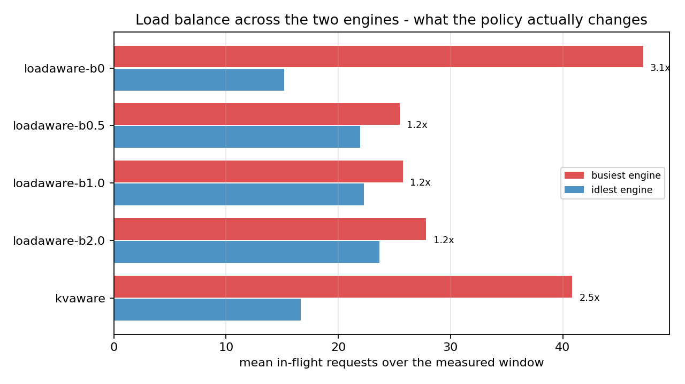
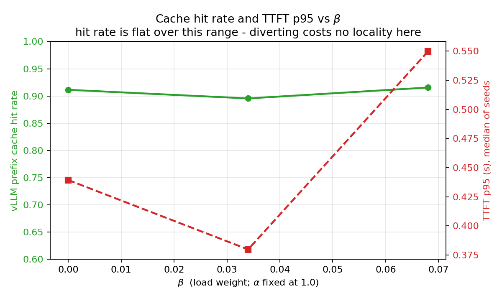
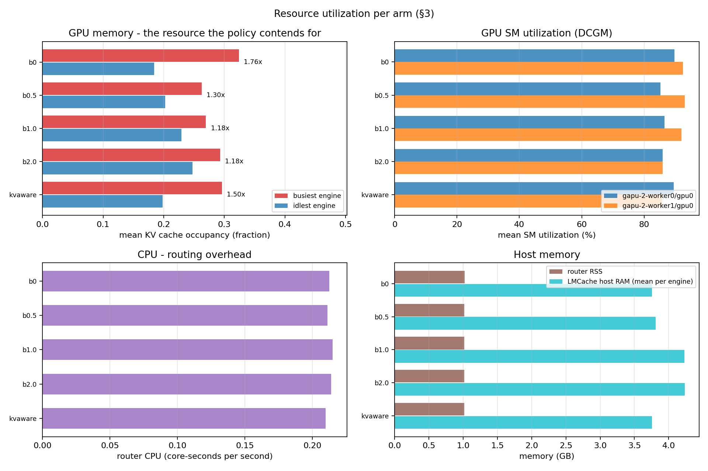

# Introduction

A KV cache stores the attention state of a prompt's prefix so a later request sharing that
prefix skips recomputing it. On a single instance, the cache policy is an eviction question:
what to keep. On a *fleet*, a second question comes first and dominates the answer — **which
instance's cache is even eligible to hit.** A request routed to instance B cannot benefit from
a prefix cached on instance A, no matter how good A's eviction policy is.

That makes placement a cache policy, not a load-balancing detail, and our measurements set the
scale of the lever. Under an identical workload, round-robin placement against the same cache
posts a median TTFT p95 of **11.528 s** against **0.426 s** for cache-aware placement — **27×**,
produced entirely by the routing decision — with a vLLM prefix-cache hit rate of **0.685**
against 0.912.

The instructive part is *why*, and it is not that round-robin balances badly. **Round-robin is
better balanced than the cache-aware baseline** — imbalance 1.723 against `kvaware`'s 2.680 —
and still 27× slower. It equalises request *counts*, not *work*: a request sent to the engine
that does not hold its prefix pays a full 2048-token prefill. Balanced counts, ruined locality.

That is the argument of this project in one comparison. Load-awareness has to be added **on top
of** cache-awareness, not substituted for it.

The baseline we build on already exploits half of that. The vLLM Production Stack ships a
`kvaware` router that asks LMCache's controller which instance holds a request's prefix and
routes there. It works, and it creates a new problem: routing *purely* by cache affinity
concentrates load. A popular prefix lives on one instance, so every request for it goes to that
instance, which then queues while its peer idles. Cache affinity and load balance pull in
opposite directions, and the stock router only pulls one way.

**This project adds the other term.** We contribute two changes:

1. **A multi-instance lookup in LMCache's controller.** The stock `lookup()` reports only the
   *first* instance holding each chunk — an acknowledged upstream TODO. No router above it can
   compare instances if it is only told about one.
2. **A `loadaware` routing strategy** that scores every endpoint by cache benefit against live
   load and takes the argmax.

Our headline result is that this **cuts load imbalance by 48.3% (p < 0.0001, 19 of 20 paired
seeds)** while leaving end-to-end latency statistically unchanged (TTFT p95 p = 0.1305). We
report the latency null as a null. The result that makes the mechanism credible is an ablation:
with the load term switched off (β = 0), the policy lands *on* the baseline (p = 0.2979) — so
the improvement comes from the load term specifically, not from having rewritten the router.

## Related work

LMCache is vLLM's KV-cache backend, supplying chunked prefix storage across GPU, CPU and disk
tiers, a controller that tracks chunk residency per instance, and cross-instance KV movement.
Its default eviction policy is LRU, pluggable through `POLICY_MAPPING` (see `docs/baseline-justification.md`). The Production Stack contributes the router, whose existing
strategies are `roundrobin`, `session`, `kvaware`, and `prefixaware`.

NVIDIA's Dynamo KV-router solves the same tension with a deduplicated-block load accounting
scheme. We measured our workload against that design and chose not to adopt it; the Discussion explains why, and what it would have bought.

# Extension design

## Change 1 — per-instance match information

`KVController.lookup()` walks a request's token chunks and resolves each through
`registry.find_kv()`, which returns the **first** instance holding that chunk in dictionary
iteration order. The upstream source acknowledges the limitation directly: *"TODO: improve the
matching logic, return multi results."*

Two consequences follow, and together they motivate the whole project:

- **No router above it can rank instances.** Comparing A against B requires knowing what *both*
  hold. The stock API structurally cannot say.
- **Replication alone cannot balance load.** Even if a hot prefix is replicated onto both
  instances, lookup names only one, so a stock KV-aware router keeps sending all hot traffic
  there. Replication and routing have to be co-designed.

We extended `lookup()` to report matched-token counts for **every** holder. Prefix credit is
**contiguous per instance**: an instance stops earning credit at its first missing chunk, so a
reported match is a real, usable prefix rather than a count of scattered chunks. The change is
additions-only and preserves the existing return shape for existing callers.

## Change 2 — the `loadaware` policy

$$\text{score}(i) = \alpha \cdot \frac{\text{matched\_tokens}(i)}{\text{prompt\_tokens}} - \beta \cdot \text{in\_flight}(i)$$

The router computes this for **every** endpoint and takes the argmax, breaking ties by URL for
determinism. Three design decisions carry weight:

**The benefit term is normalized to the cached fraction, not the raw token count.** With raw
counts, one (α, β) pair means different things at different prompt lengths, and the
parameter sweep would be measuring prompt-length distribution as much as policy. Normalized,
β has a direct operational reading: **1/β is the number of in-flight requests that cancel out a
full cache hit.**

**The load signal already existed and was already being ignored.** `EngineStats` scrapes
`num_running_requests`, `num_queuing_requests` and `gpu_cache_usage_perc` per instance and hands
them to *every* `route_request()` call. `KvawareRouter` uses none of it. Our scoring function
plugs in exactly there — no new collection path, no new failure mode.

**`kvaware` is left byte-identical.** The diff is additions-only: a new enum member, a factory
branch, and a new class. The baseline arm we measure against is the unmodified upstream code
path, not our code with a flag flipped.

One defect surfaced in review and is worth recording because it is invisible until an engine
restarts: the `instance_id → URL` bridge must refresh when an engine comes back under a fresh
id, and only the *live* id may be credited. Without that, placement silently degenerates to
least-loaded for the remaining life of the router.

## Tunable parameters

| Parameter | Env var | Default | Meaning |
|---|---|---|---|
| α | `LOADAWARE_ALPHA` | 1.0 | Weight on cache-hit benefit (cached fraction of prompt) |
| β | `LOADAWARE_BETA` | 0.1 | Weight on live load; 1/β = in-flight requests that cancel a full cache hit |

β = 0 reduces the policy to pure cache affinity and is the ablation arm in the Results.

# Experimental setup

**Hardware and stack.** OpenShift, two worker nodes with one NVIDIA A10 (23 GB) each, serving
`Qwen/Qwen2.5-3B-Instruct` through the `vllm/vllm-stack` Helm chart pinned at 0.1.11. Baseline
arms run the stock router image `lmcache/lmstack-router:0.1.9.dev9-g37bafbcf5.d20260107`
against engines on the version-matched `vllm-openai:v0.3.9post2` (both LMCache 0.3.9post2).
Extended arms run an image built **in CI** from this repository's `Dockerfile` and pushed
SHA-tagged to Quay, so the measured artifact is always reproducible from the tree. The
development-loop ConfigMap overlay is never benchmarked, and each cell asserts its router
image against the expected label before recording anything.

**Workload.** One frozen dataset: a pool of **128 shared prefixes × 2048 tokens**, each request
drawing a prefix by **Zipf s = 0.9** and appending a 32-token unique suffix, 64 output tokens,
500 requests per seed, **20 seeds**. Seeds share the prefix pool and vary only sampling order
and suffixes. The pool is generated deterministically from `pool_seed=42` and pinned by a
SHA-256 manifest that every cell re-verifies, so a drifted workload fails loudly rather than
quietly invalidating a comparison. This is the *repetitive-prompt* profile — it stresses the
hit/miss ratio, which is the regime where placement matters.

**Operating point.** Requests arrive open-loop as a Poisson process at **16 req/s**. That rate
was chosen by a pilot and is the point where latency departs its plateau: TTFT p95 is 2.69× its
idle value and ITL p95 is 4.55×. This mattered more than we expected — an earlier sweep at
10.5 req/s produced `num_requests_waiting` = 0.00 on both engines, meaning nothing queued
anywhere and a load-aware router had no load to be aware of. **Choosing the operating point is
part of the experiment, not a preliminary to it.**

**Metrics.** Latency is client-observed and taken from the driver's per-request CSVs — TTFT,
inter-token latency, and end-to-end, at mean/p50/p90/p95/p99. The driver is the only
percentile-capable source: the router exposes average-latency gauges only, and engine-side
histograms start their clock at the engine and miss router overhead. Load imbalance is
busiest-over-idlest `vllm:num_requests_running`, scraped per engine at 5 s resolution. Cache
hit rate comes from `lmcache:lookup_hit_rate`, GPU utilization and power from DCGM.

**Statistics, pre-registered before the comparator ran.** One seed replay is **one
observation** (n = 20); per-request samples are queue-correlated and never treated as
independent evidence. Tests are one-sided **exact Wilcoxon signed-rank** on paired per-seed
differences, with effect sizes as the median relative difference and a seeded bootstrap 95% CI
over 10 000 resamples. Two co-primaries — TTFT p95 and load imbalance — give a Bonferroni
threshold of **0.025**. Throughout this report, a headline percentage is the *median over the
20 paired per-seed relative differences*, never a ratio of pooled means.

**Validity rules, also pre-registered.** Errored requests are excluded from latency statistics
but counted; a comparison is voided when error rates differ materially between arms (> 2× ratio
*and* > 1 pp absolute), with a 10% catastrophic ceiling. `analyze.py compare` **refuses** to
pair two runs whose recorded rate or workload manifest differ — "identical workload across
arms" is enforced by the tooling, not asserted in prose. Every cell restarts the engines so
each arm begins from an identical empty cache, then waits for both workers to re-register and
passes a registry probe before any measured request is sent.

# Results

## Headline

| Co-primary | `kvaware` | `loadaware` β=0.034 | Median change | Wilcoxon p |
|---|---|---|---|---|
| Load imbalance | 2.680 | 1.296 | **−48.3%** (19/20 seeds) | **< 0.0001** |
| TTFT p95 (s) | 0.426 | 0.378 | −8.2%, CI [−8.6%, +32.2%] | 0.1305 |

All five arms at the operating point, medians across seeds:

| Arm | n | TTFT p95 (s) | ITL p95 (s) | Imbalance | Achieved req/s |
|---|---|---|---|---|---|
| `roundrobin` | 3 | 11.528 | 0.863 | 1.723 | **10.7** |
| `kvaware` (baseline) | 20 | 0.426 | 0.171 | 2.680 | 14.2 |
| `loadaware` β=0 (ablation) | 20 | 0.438 | 0.185 | 2.646 | 14.2 |
| `loadaware` β=0.034 (**headline**) | 20 | 0.378 | 0.143 | 1.296 | 14.5 |
| `loadaware` β=0.068 | 3 | 0.550 | 0.097 | 1.061 | 14.7 |

The two n=3 cells are **descriptive curve points, not hypothesis tests**, and the tooling
enforces that: `analyze.py` refuses to pair a 3-seed cell against a 20-seed one. Note also that
`roundrobin` achieved only 10.7 req/s against 16 offered while every other arm delivered
14.2–14.7. It is **saturated and therefore not at the same operating point**, so the honest
headline for that arm is the throughput shortfall; the 27× latency ratio is a consequence of
being unable to keep up, not a like-for-like latency comparison.

Imbalance clears the Bonferroni-corrected threshold by three orders of magnitude. TTFT p95 does
not clear it, and we report it as a null rather than reaching for a subgroup or a different
percentile that would. Twelve of twenty seeds improve — the signature of no effect, not of a
small one (Figure 4).



## The ablation is the finding

| Arm | Median imbalance | vs `kvaware` |
|---|---|---|
| `kvaware` (baseline) | 2.680 | — |
| `loadaware` β = 0 | 2.646 | p = 0.2979 — indistinguishable |
| `loadaware` β = 0.034 | 1.296 | p < 0.0001 |

With the load term switched off, our policy is statistically indistinguishable from the
baseline on imbalance *and* on latency (TTFT p95 p = 0.8529, ITL p95 p = 0.4927). **The load
term is the entire mechanism.** Rewriting the router bought nothing on its own; the β term
bought everything.

This was pre-declared falsifiable: a β = 0 arm landing near 1.30 would have meant the
improvement came from some incidental difference in our implementation rather than from the
policy, and would have voided the headline. It did not.

## Parameter sensitivity

**At the operating point, β trades TTFT against ITL.** Across β ∈ {0, 0.034, 0.068} the
prefill-side metric worsens while the decode-side metric improves: TTFT p95 runs
0.438 → 0.378 → 0.550 s while ITL p95 runs 0.185 → 0.143 → **0.097** s, a 32% decode
improvement at the top of the range. β = 0.034 sits near the TTFT optimum, β = 0.068 near the
ITL optimum. Which one is "best" depends on whether the deployment is latency-to-first-token
sensitive or streaming-throughput sensitive; we report both rather than picking the flattering
one.

**The cache does not pay for that trade in this range, and we say so even though it costs us an
explanation.** The vLLM prefix-cache hit rate is *flat* across the grid — 0.911, 0.896, 0.916 —
and engine-local lookup hit rate sits at ~0.96 on every cache-aware arm regardless of β.
Nothing is being diverted off its cached instance here. So the TTFT rise at β = 0.068 is
**recorded as unexplained**. The most likely cause is n=3 noise: TTFT p95 is dominated by bursty
engine stalls, one to three per seed, a Poisson count with no routing content. But that is a
hypothesis, not a finding, and a figure must not claim a mechanism its own data refutes.

The wider 10.5 req/s sweep does show the cache-cost mechanism, at larger β: hit rate falls
0.918 → 0.787 → 0.735 across β ∈ {0, 0.5, 1.0} and latency degrades 4–6×. The rate-16 grid
catches the same trade-off while it is still a trade-off rather than a blow-up.

A caution on the *other* hit-rate metric: `lmcache:lookup_hit_rate` is scraped from the engines,
so it measures each engine against its **own** local cache rather than whether the router chose
the instance holding the KV. It saturates near 0.95 on every arm including round-robin and does
not discriminate between policies. Every hit-rate number in this report is the vLLM
prefix-cache counter.



## Resource cost



The policy is not buying its result by spending more hardware. At the operating point both
GPUs run at 76–93% utilization on every arm and total board power is flat at ~228 W, which is
also the direct evidence for the compute-saturation argument in the Discussion. Engine resident
memory is unchanged at ~1.0 GB. The router's own CPU cost rises from 9.4% under `kvaware` to
11.3% at β = 0.034 — scoring every endpoint instead of taking the first holder is not free, but
it is a fraction of one core on the control plane, not a serving cost.

## What we declined to claim

`itl_p95` reaches p = 0.0060 against the β = 0 arm — an attractive result. We do **not** promote
it. It crosses the significance line between replicate cells (0.0291 and 0.0570), and promoting
a metric after seeing its p-value is the same error as adding seeds after seeing a p-value.
It stays a diagnostic.

Similarly, no seeds were added after the TTFT p95 null appeared, at either operating point.

# Discussion

**Why latency did not move, and why that is coherent.** This system saturates on **compute**,
not memory. At the measured operating point the busiest engine ran 59–100 mean concurrent
requests with `num_requests_waiting` = 0.00, zero preemptions, and 0.0 ms of queue time.
Prefix caching makes concurrency nearly free in KV terms — roughly 530 KV tokens per in-flight
request against 1578-token prompts, measured on the load-gate probe — so against the
104,624-token pool, KV usage tops out near 0.70 and never exhausts. The baseline's pathology is therefore **decode-batch concentration**,
not queueing. Balancing in-flight requests fixes the concentration, which is exactly the metric
that moved; it does not fix a queue that was never there, which is exactly the metric that
did not.

**The honest shape of the contribution.** We changed how work is distributed, and we can prove
that with high confidence. We did not demonstrate that this makes the fleet faster at this
operating point. A reader deciding whether to adopt this policy should read the imbalance
result as the claim and the latency null as the boundary of it. Imbalance is not merely
cosmetic — it is the mechanism by which the fleet has headroom, and it is what determines
behaviour under a burst — but this experiment did not measure the burst.

**β is tied to absolute concurrency.** This is the sharpest limitation. Because the load term
uses raw in-flight counts, the useful β moves with the offered rate. Two calibration probes at
the same rate produced β = 0.034 and β = 0.013. We deliberately did not fix this mid-experiment
— changing the policy after seeing data is how pre-registration dies — but a production version
should normalize load the way the benefit term is already normalized. That is the single
highest-value follow-up.

**Deduplicated-block load accounting, and why we passed.** NVIDIA's Dynamo KV-router accounts
for load in deduplicated blocks rather than requests. We measured the dedup factor in our own
workload (0.69 at 10.5 req/s, 0.45 at 7.5) and estimated the headroom at ~9% on imbalance and
~5% on hit rate. Adopting it requires per-worker block tracking plus a completion hook, which
would invalidate every run already recorded, and the gain only materializes under cache
scarcity — which our workload never reaches (KV usage max 33%, `num_requests_waiting` 0).
We document it as a limitation rather than a deficiency.

**Two measurement artifacts, both biasing against us.** Backend disconnects hit a path where
`on_request_complete` is skipped, drifting the router's own in-flight gauge by +4 to +7 on one
engine over a run. It biases *against* the extension and is ~10× smaller than the reported
effect, and a zero-failure cell reproduces the result. Separately, LMCache's KV registry has a
~40 s blind window after any router restart during which admissions are lost, and a prefix
first stored in that window stays invisible to the controller for the life of the engine
process. Both arms would then degrade to QPS routing and look identical *for the wrong reason*.
Every run in this report is gated on a registry probe that must pass before warm-up begins.

# Conclusion and future work

We extended LMCache's controller to report per-instance prefix-match information — closing an
acknowledged upstream TODO — and added a `loadaware` placement policy to the vLLM Production
Stack router that scores cache benefit against live load. Under a Zipfian shared-prefix
workload at the latency knee, it reduces load imbalance by **48.3%** (p < 0.0001, 19/20 paired
seeds) at statistically unchanged end-to-end latency, and an ablation shows the load term is
the entire mechanism.

The unexpected lesson was methodological. Our first sweep produced a plausible-looking 4.7%
latency improvement that was **entirely an artifact of the operating point**: nothing had
queued, so there was no load to be aware of, and what we had measured was residual cache
locality. Finding the knee, and gating each run on a measured degradation criterion rather than
on a counter that can fire without harming anyone, turned a flattering non-result into a
defensible one. The rate is not a parameter of the experiment; it *is* the experiment.

Three follow-ups, in order of value:

1. **Normalize the load term** the way the benefit term is already normalized, so β stops
   depending on absolute concurrency. This is a small change with a large effect on usability.
2. **Measure under cache scarcity.** Every effect we care about should be larger when the cache
   cannot hold the working set, and that is where deduplicated-block accounting would pay off.
3. **Measure under bursts.** Imbalance is a claim about headroom; a burst workload is where
   headroom converts into latency, and it is the most likely place for the latency null to
   become a latency win.

\newpage

# Appendix A — Code and data artifacts

Every figure and statistic in this report is recomputable from the repository with no cluster
and no GPU.

| Artifact | Location |
|---|---|
| Router + LMCache modifications | `patches/` (mirrors in-image paths) |
| Unit tests (116, all offline) | `tests/`, `benchmarks/test_*.py` |
| Workload generator + SHA-256 manifest | `benchmarks/workload_gen.py`, `benchmarks/workloads/manifest.json` |
| Load driver, gates, collectors | `benchmarks/load_driver.py`, `load_gate.py`, `scarcity_gate.py`, `collectors/` |
| Statistics (Wilcoxon + bootstrap) | `benchmarks/analyze.py` |
| Figure generation | `benchmarks/plot_results.py` |
| Per-seed derived table | `results/summary-per-seed.csv` |
| Baseline justification (guidelines §2) | `docs/baseline-justification.md` |
| Requirements audit | `docs/requirements-audit.md` |

## Run provenance

| Arm | Run directory | Rate | Seeds |
|---|---|---|---|
| `kvaware` (baseline) | `results/20260804-151901-kvaware` | 16 | 20 |
| `loadaware` β = 0 (ablation) | `results/20260804-155356-loadaware-b0` | 16 | 20 |
| `loadaware` β = 0.034 (headline) | `results/20260804-135033-loadaware-b0.034` | 16 | 20 |
| `loadaware` β = 0.034 (replicate) | `results/20260804-002923-loadaware-b0.034` | 16 | 20 |
| `loadaware` β = 0.068 (curve point) | `results/20260804-190542-loadaware-b0.068` | 16 | 3 |
| `roundrobin` | `results/20260804-191644-roundrobin` | 16 | 3 |
| β sweep {0, 0.1, 0.5, 1.0} | `results/20260803-2*` | 10.5 | 3–10 |

Each run directory contains the per-request driver CSVs, the Prometheus scrapes, `dcgm.csv`,
and a `run.json` recording the arm, α/β, rate, router image and image ID, git commit, and the
workload manifest with per-seed SHA-256 checksums.

## Reproducing

```bash
pip install -r requirements.txt
pytest benchmarks/ tests/ -q

python3 benchmarks/analyze.py compare \
  results/20260804-135033-loadaware-b0.034 results/20260804-151901-kvaware
python3 benchmarks/plot_results.py results/20260804-151901-kvaware \
  results/20260804-155356-loadaware-b0 results/20260804-135033-loadaware-b0.034 \
  results/20260804-190542-loadaware-b0.068 results/20260804-191644-roundrobin \
  --cand loadaware-b0.034 --out docs/figures
```
