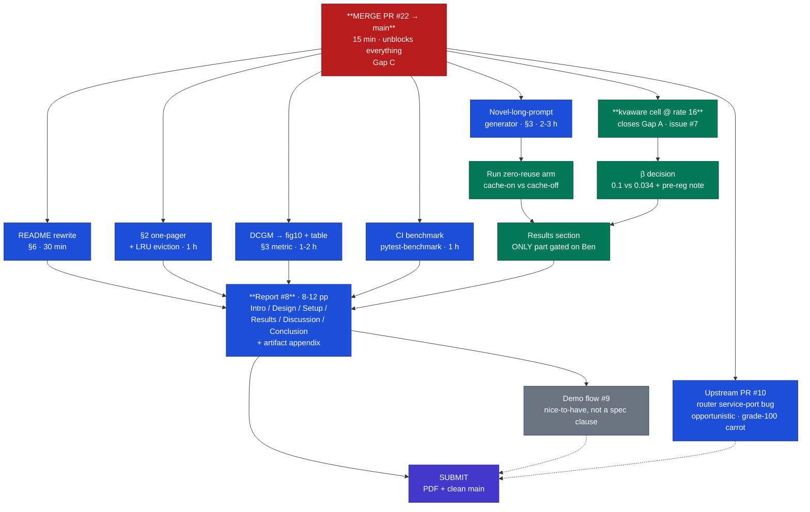

# Requirements Audit — every clause of the Final Project Guidelines

> status: live · **2026-08-05** · clause-by-clause audit of `docs/references/Final Project
> Guidelines.pdf` against the **integration branch** (`feat/relative-load-normalization`) plus
> this branch. Verified against files and `results/`, not against the CHANGELOG's claims.
> Re-run the checks before trusting it after new commits.
>
> **Revised 2026-08-05** after the policy changed underneath it: α was removed, the load term is
> now normalized against the fleet mean, the driver moved in-cluster (#27), and utilization
> reporting landed via #35. Rows that referenced α, β = 0.034, or WAN-measured latency have been
> corrected rather than left to rot.

Ordered **by rubric weight**, not by section number. Correctness + Reproducibility = 70%.

Legend: ✅ done · 🟡 partial · ❌ missing

---

## Scoreboard

| # | Clause (PDF §) | State | Evidence / gap |
|---|---|---|---|
| 1 | §7 Correctness — passes tests (40%) | ✅ | 116 tests green (`pytest benchmarks/ tests/`), incl. `tests/test_loadaware_routing.py`, `tests/test_kv_controller_lookup.py` |
| 2 | §4 Cleanly-factored code on a **feature branch** | ✅ | `feat/loadaware-routing` (PR #17, merged), `feat/multi-instance-lookup` (#15), `feat/evaluation-runs` (#22, open) |
| 3 | §4 Unit tests covering the new policy | ✅ | `tests/` loads `patches/` directly with `lmcache` stubbed — no cluster/GPU needed |
| 4 | §4 Compatible with the baseline cache interface | ✅ | `patches/` mirror in-image paths; `LoadAwareRouter` subclasses the stock routing-logic contract |
| 5 | §4 Tunable parameters exposed | ✅ | `LOADAWARE_BETA` env + ctor arg. α was **removed** — with the benefit term normalized to the cached fraction, a second weight was a redundant scale factor |
| 6 | §4 …**and documented** | ✅ | Docstring, README tunables table with the `1/(2β)` cancellation rule, and the report's Extension Design |
| 7 | §4 …demonstrating their impact on performance | ✅ | β sweep {0, 0.5, 1.0, 2.0} at n=20 each; imbalance 2.647 → 1.262 → 1.209 → 1.188 |
| 8 | §3 Metric: per-request latency mean/p95/p99 | ✅ | `analyze.py` → `summary-per-seed.csv` (+ p50, p90, ITL percentiles) |
| 9 | §3 Metric: cache hit rate | ✅ | `fig3-hit-rate.png` from `lmcache:lookup_hit_rate` |
| 10 | §3 Metric: throughput (req/s, tok/s) | ✅ | `throughput_req_s`, `throughput_tok_s`; `fig9-throughput.png` |
| 11 | §3 Metric: **memory & CPU/GPU utilization** | ✅ | `benchmarks/utilization.py` + `fig10-utilization.png` (#35, Ben) — GPU SM/power/mem-copy from DCGM, KV-cache memory per engine, router CPU and memory, with a **coverage gate** so gaps are not silently averaged over. Names what is unavailable (vLLM registers no process collector) instead of omitting it |
| 12 | §3 Workload profile: repetitive/cacheable prompts | ✅ | Zipfian shared-prefix pool, frozen + SHA-pinned (`workloads/manifest.json`) |
| 13 | §3 Workload profile: **novel long prompts (unlikely to be cached), to measure cache overhead** | 🟡 | **Harness done, run pending (#25).** `NovelWorkloadConfig`, 6 frozen seeds under `workloads/novel/` with their own manifest, reuse-factor 1.0 asserted at freeze time, 7 unit tests. `WORKLOAD_PROFILE` threads through `run_cell.sh` → `bench_job.sh` → pod env → `verify_dataset.sh` and lands in `run.json`. Re-verified: the manifest still reproduces bit-identically after `9d14c95` changed `WorkloadConfig`'s defaults |
| 14 | §3 Benchmark scripts | ✅ | `benchmarks/` — generator, driver, gates, collectors, choreography |
| 15 | §3 **Integrate into CI so all commits rerun the suite** | ✅ | `pytest-benchmark` declared; `tests/test_bench_routing.py` times the placement hot path (score, fleet scan, id→URL bridge, load read) against the tracked patch files; CI runs the suite with `--benchmark-disable` then a timed `--benchmark-only` pass. README states plainly which part cannot run in CI and why (issue #24) |
| 16 | §3 README "how to benchmark" + sample CSV/JSON logs | ✅ | `benchmarks/README.md` (operator's manual) + `results/` tracked in git (364 files) |
| 17 | §5 Vanilla vs extended, identical workload | ✅ | 5 arms × 20 seeds at rate 16 on the current policy (`results/20260805-*`), replayed in-cluster. `analyze.py compare` refuses to pair runs whose rate or workload manifest differ |
| 18 | §5 Sweep key parameters | ✅ | β grid + rate pilot + scarcity/load gates |
| 19 | §5 Plot latency distributions & hit-rate curves | ✅ | fig1–fig9 (ECDF, percentiles, paired seeds, hit rate, imbalance, β trade-off) |
| 20 | §5 Relative improvements (e.g. % at p95) | ✅ | Wilcoxon + bootstrap CI, pre-registered; medians and p-values in `results/summary-per-seed.csv` + issue #7 |
| 21 | §5 **Ablation** isolating each idea | ✅ | `loadaware-b0` isolates cache-awareness from the load term; `roundrobin` isolates routing from caching |
| 22 | §5 Deliverable: **a PDF describing the experiments** | ✅ | **Folded into the §6 report** — §4 Results and §5 Discussion carry the experiments, their results, and what each one tells us. Decision recorded here so it is not left implicit |
| 23 | §6 Clean GitHub repo + README with install & benchmark instructions | ✅ | README rewritten 08-04: headline result with provenance, repo map, install, tests, tunables, **verify-without-a-cluster** path, cluster repro. Stale `benchmarks/README.md` claim that `results/` is gitignored also corrected |
| 24 | §6 Dockerfile / environment.yml | ✅ | `Dockerfile` + `.github/workflows/router-image.yml` builds it in CI (needs the Quay secrets set to also push) |
| 25 | §6 **Report PDF, 8–12 pages, six named sections** | 🟡 | Full draft, all six sections, built to PDF in CI and glyph-checked. Rewritten 08-05 for the post-α policy. **The latency row is deliberately open** pending #31's in-cluster re-run; everything else is written |
| 26 | §6 Appendix referencing all code and data artifacts | ✅ | Appendix A: artifact table, run-provenance table (arm → run dir → rate → seeds), and a copy-pasteable reproduce block |
| 27 | §6 Formatting (≥10 pt, labelled axes, legends, captions) | ✅ | 11 pt body, captions on every figure, labelled axes and legends throughout. `fig4-paired-seeds` labels now de-collide with leader lines back to their points; `fig10`'s legend no longer sits on a bar |
| 28 | §2 **One-page baseline justification** (features, **default eviction policy**) | ✅ | `docs/baseline-justification.md` — both recommended criteria, main features, **default eviction policy LRU** (pluggable `POLICY_MAPPING`, `LMCACHE_CACHE_POLICY`), the gap we chose to close, and rejected alternatives |
| 29 | §4 Upstream PR — the explicit **grade-100 carrot** | ✅ | **[vllm-project/production-stack#1029](https://github.com/vllm-project/production-stack/pull/1029)** filed 2026-08-04 — router Service never exposed the LMCache controller reply/heartbeat ports the same chart points engines at. DCO-signed, `[Bugfix]`-prefixed, `helm template` proof that defaults render byte-identically. Merge is upstream's call; *filed* is the evidence |
| 30 | §7 Performance gain, statistically significant (15%) | ✅ | Load imbalance **−43.7% median, p<0.0001, 20/20 seeds** at β=0.5, with the β=0 ablation null — the mechanism is the load term, not the rewrite. Imbalance was a **pre-registered co-primary in #3, not promoted after the latency null**. Latency itself is being re-measured on a fixed instrument (#31) rather than reported from WAN-polluted data |

---

## Gap A — CLOSED 2026-08-04 by `1691acb` (Ben)

The missing comparator landed while this audit was being written: `20260804-151901-kvaware` and
`20260804-155356-loadaware-b0`, 20 seeds each, both now in `results/summary-per-seed.csv`.

**Result:** load imbalance **−48.3%, p<0.0001, 19/20 seeds**, replicated at −52.7% against the
00:29 candidate cell. TTFT p95 is a **null (p=0.1305)**.

**Statistic definitions — pin these once, the report inherits them.** Every headline percentage
is the *median over the paired per-seed relative differences* `(candidate − baseline)/baseline`,
n=20, not a ratio of pooled means. Imbalance levels quoted below (2.646, 2.680, 1.296) are
per-seed **medians**; the means differ noticeably (β=0 2.918, kvaware 3.130), so the imbalance
distribution is right-skewed and the report must say which statistic it is quoting each time.
An independent recompute of the headline gives −48.2% against Ben's committed −48.3%; the
difference is rounding, not a discrepancy. The β=0 ablation is the finding that
matters: it lands *on* the baseline (imbalance 2.646 vs kvaware 2.680, p=0.2979, no latency
difference either), while β=0.034 sits at 1.296 — so **the load term is the entire mechanism**,
and the routing implementation on its own does nothing. That was pre-declared falsifiable.

Scoreboard rows 17 and 30 upgrade to ✅ on the strength of this. Three things carry into the
report rather than being resolved by it:

1. **The headline arm is now β=0.034, not the shipped default β=0.1.** Ben records it as
   pre-registered on #3 before the comparator ran, which is the right discipline — but the
   report must state the derivation (`β·delta_load = α·0.5` at rate 16) *and* that a second
   probe at the same rate gave β=0.013. β being tied to absolute concurrency is a real §6
   limitation, not a footnote.
2. **TTFT is a null, twice.** p=0.0527 at 10.5 req/s, p=0.1305 at rate 16. The report says so
   plainly; the claim to fame is load balance, and the β=0 ablation is what makes it a
   *mechanism* rather than a correlation.
3. **`itl_p95` was not promoted** despite p=0.0060 against β=0, because it crosses the line
   between replicate cells. Say that in the report — declining a favourable metric is evidence
   of discipline and is worth more than the metric would have been.

The original text of this gap follows, since the plan below was built on it.

### (superseded) The confirmatory sweep at the knee is one-armed

**Verified, not inferred.** `results/` holds exactly two runs from 2026-08-04, both
`loadaware-b0.034` (`20260804-002923`, `20260804-135033`). There is **no `kvaware` cell at
rate 16**, and `results/summary-per-seed.csv` contains **no 2026-08-04 rows at all** — every
row in it is from the 08-03 sweep.

Consequences to face directly:

1. The project's only paired result remains the 08-03 one: **imbalance significant
   (median 25.9%, p=0.0049), TTFT p95 not significant (p=0.0527)**. If nothing else lands,
   the report's headline must be **load balance**, with TTFT reported honestly as null.
2. The 08-04 runs use **β=0.034**, derived from a single rate-16 probe whose twin gave
   β=0.013. The *shipped default and swept headline* is β=0.1. Switching the headline arm
   after seeing data is the same optional-stopping hazard the project has otherwise been
   disciplined about — if β=0.034 becomes the headline, it needs a written pre-registration
   note, or it stays a sensitivity point and β=0.1 stays the headline.
3. The 08-04 driver fix means these are the **first runs with a valid ITL measurement**;
   any ITL number in PR #22 never existed. Old ITL claims must not survive into the report.

**Minimum to close it:** one `kvaware` cell at rate 16 with the same 20 seeds, then
`analyze.py` + `export_summary.py` over both, appending to `summary-per-seed.csv`.

## Gap B — the framing risk

The spec says "enhanced **cache policy**"; §4's examples are eviction / hierarchy /
approximate matching; §2 asks for the baseline's **default eviction policy**; §7 says "the
**cache** behaves as expected". This project ships a **router placement policy**. A strict
reader could call that adjacent to the brief.

Do not change the project — change the report's opening move: in a distributed KV cache,
**placement is the cache policy**, because the router decides which instance's cache is even
eligible to hit, and therefore sets fleet-wide effective hit rate. The project's own data is
the proof: `roundrobin` 0.709 hit rate / 5.502 s TTFT p95 vs cache-aware 0.918 / 0.30 s —
**18×**. Keep cache hit rate a first-class reported outcome, and put LMCache's real default
eviction policy (LRU) in the §2 one-pager so it is clear the baseline's cache mechanics were
understood, not skipped.

---

## Ordered plan to 100% (deadline 2026-08-10)

**Ownership agreed 2026-08-04:** Ben owns the benchmark/evaluation arm (cluster runs, β,
making the policy win). Eliad owns everything else. Cheap-and-required first; each line is
independently shippable.

| # | Item | Owner | Est. | Cluster? | Fixes |
|---|---|---|---|---|---|
| 1 | **README rewrite** — kill "under construction"; install → test → benchmark → `LOADAWARE_ALPHA`/`LOADAWARE_BETA` table → where results live | Eliad | 30 min | no | #6, #23 |
| 2 | **§2 one-pager** `docs/baseline-justification.md`, ≤1 page from `feasibility-verification.md`; **must** state LMCache's default eviction policy (LRU) | Eliad | 1 h | no | #28 |
| 3 | **`kvaware` cell at rate 16**, same 20 seeds → closes Gap A. Gate on `registry-probe.sh` + `load_gate.py`; `revert-router-patch.sh` before the baseline | **Ben** | ~1 h | **yes** | #17, #30 |
| 4 | **DCGM into the analysis** — `fig10-utilization.png` + GPU/mem util row per arm. Data already on disk for every run | Eliad | 1–2 h | no | #11 |
| 5 | **Novel-long-prompt profile** — zero-reuse workload, cache-on vs cache-off, reported as *cache overhead on misses*. Generator + analysis is desk work; the run is Ben's | Eliad (build) / Ben (run) | 2–3 h + ~40 min cluster | partly | #13 |
| 6 | **CI benchmark** — add `pytest-benchmark`, time the scoring function + workload generator; README sentence on why the cluster arm can't run in CI | Eliad | 1 h | no | #15 |
| 7 | **The report** — 8–12 pp, six named sections, opens with the Gap-B framing, headline = load imbalance, TTFT reported as null, appendix mapping figure → `results/` dir → commit SHA | Eliad | 2 days | no | #22, #25, #26, #27 |
| 8 | **Upstream PR** — file at least one; the router-service-port bug is far more self-contained than the extension. *Filed* is evidence even unmerged | Eliad | half day | no | #29 |

Only items 3 and the run half of 5 need the GPUs. Everything in Eliad's lane is desk work and
is unblocked today — item 7 is the long pole and should start before the sweep lands, since
only its Results section depends on Ben's numbers.

---

## Gap C — `main` is 22 commits behind, and `main` is what the grader clones

`origin/main` does **not** contain: the driver TTFT fix, `load_gate.py`, `plot_results.py`,
`export_summary.py`, any figure, any of `results/`, or any doc written on 08-03/08-04. All of
it sits on `feat/evaluation-runs` behind **PR #22** (`MERGEABLE`, `CLEAN`, +115k/-108).

So today a `git clone` of this project yields a README that says *"the harness is under
construction"* attached to a repo where that is **true**. Against a 30% reproducibility weight
this is the highest-leverage *cheap* action available, and it costs one merge.

**Verified before recommending it:** `gh pr checks 22` is green on both `test` runs, and the
branch is 0 behind `main`, so the merge result is what CI actually tested. Merging a red PR
would move `main` from *honestly unfinished* to *claims to work and doesn't* — strictly worse.

**Do this first.** Everything below assumes work lands on `main`, not on a side branch.

---

## Flow to submission (today 2026-08-04 → ~2026-08-10)

### Issue ledger — what each open ticket still needs

| Issue | Owner | Still needs | Spec clause |
|---|---|---|---|
| **PR #22** | Eliad | **Merge it.** Gap C | §6 repro |
| **#7** evaluation runs | Ben | `kvaware` @ rate 16 + β decision + `summary-per-seed.csv` regenerated with 08-04 rows | §5, §7 gain |
| **#8** report | Eliad | Everything. Start the 5 non-Results sections now | §5, §6 |
| **#9** demo flow | either | Scripted e2e demo. **Not a spec clause** — cut it first if time runs out | — |
| **#10** upstream PRs | Eliad | **1 of 2 filed** — production-stack#1029. The second candidate (LMCache multi-instance `lookup()`) is a much larger cache-layer PR; deliberately not attempted before the deadline, recorded on the ticket rather than left implied | §4 carrot |
| **#1** map | — | Closes when #7, #8 land | — |
| *(no ticket)* | Eliad | §2 one-pager, DCGM reporting, CI benchmark, zero-reuse workload | §2, §3 |

Four audit gaps have **no GitHub issue at all** (bottom row) — they were never on the map, which
is why they went unnoticed. File them as sub-issues of #1 or they will slip again.

### Focus rule

The diagram's purple lane is *ownership*, not priority. Priority within it:

- **Never cut** — the merge (Gap C), the README, the §2 one-pager, the report. The first three
  are minutes-to-hours of work protecting a 30% weight; the report is 15% on its own and carries
  the other 55% by being the only place the grader sees any of it.
- **Cut in this order if time runs short** — #9 demo → second upstream PR → zero-reuse workload
  → DCGM figure → first upstream PR.

Note what that ordering costs: the zero-reuse workload and the DCGM figure are the two
*outright-missing §3 clauses*. Cutting them is trading named spec clauses for report quality —
defensible under a 15% clarity weight plus 40% correctness, but it is a trade, so make it
knowingly rather than by running out of days.
